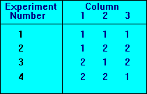

# Orthogonal Array (OA) with Two Levels Construction

This repository contains Python implementation for constructing Orthogonal Array (OA) with two levels to solve D-dimensional problems.

## Usage / Example
-> Demo code: [example_usage.py](https://github.com/achmadsyahrul/oa-2levels/blob/master/example_usage.py)
```python
from oa.oa_2levels import construct_OA

D = 3
OA = construct_OA(D)
print("Orthogonal Array with Two Levels:")
print(OA)
```

## Result
Example with D=3, we can get result:
``` bash
[[1 1 1]
 [1 2 2]
 [2 1 2]
 [2 2 1]]
```

We can denote it as L<sub>4</sub>(2<sup>3</sup>).



## References

- [1] Math. Stat. Res. Group, Chinese Acad. Sci., *Orthogonal Design* (in Chinese). Beijing, China: People Education Pub., 1975.
- [2] S.-Y. Ho, L.-S. Shu, and J.-H. Chen, “Intelligent evolutionary algorithms for large parameter optimization problems,” *IEEE Trans. Evol. Comput.*, vol. 8, no. 6, pp. 522–541, Dec. 2004.
- [3] Zhan, Zhi-Hui, Jun Zhang, and Ou Liu. "Orthogonal learning particle swarm optimization." Proceedings of the 11th Annual conference on Genetic and evolutionary computation. 2009.

## Image References
- [1] [The University of York](https://www.york.ac.uk/depts/maths/tables/l4.gif)
